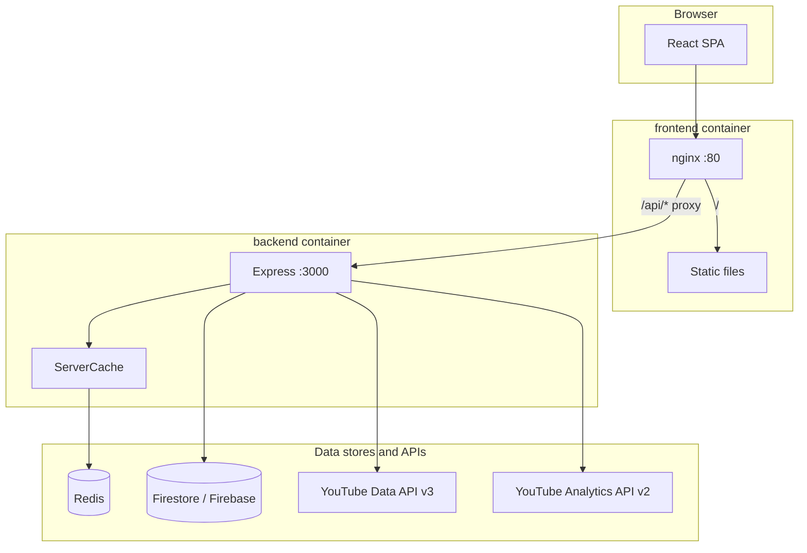

# RevTube (TubeKeter Analytics)

Single overview of how the repo is structured and how requests, services, and data flow fit together. For deep dives, see the linked docs at the end.

## What this project is

A **React + Express** app for YouTube channel analytics: dashboards, videos, playlists, compare flows, organizations, and admin tools. The browser talks to your **backend**, which calls **YouTube Data API**, **YouTube Analytics API**, and **Firebase/Firestore**. Optional **Redis** backs server-side caching.

## Repository layout

| Path | Role |
|------|------|
| `frontend/` | Vite 7 + React 19 + TypeScript 5.9 SPA; production build served by nginx in Docker. |
| `backend/` | Express 5 (CommonJS) app with a modular architecture: `routes/`, `middleware/`, `services/`, `queue/`, `cache/`, `config/`, `utils/`, `ingestion/`, `db/`, `chat/`. Wired via `backend/index.js`. |
| `docker-compose.yml` | Wires `postgres`, `redis`, `redis-queue`, `backend` (port 3000), `frontend` (nginx on 80, host port 8081). |
| `docs/` | **All reference documentation.** Numbered sections; start at `docs/README.md`. |
| `docs/context/` | Dated per-system change log written by the agent workflow. Not reference documentation. |
| `.codegraph/` | SQLite code index used to answer "what calls what" without reading whole files. |

## Major libraries (and what they’re for)

### Frontend (`frontend/package.json`)

| Library | Role in this app |
|---------|------------------|
| **React 19** + **TypeScript 5.9** | UI and typing. |
| **Vite 7** | Dev server, production build, and PWA service worker. |
| **react-router-dom 7** | Client-side routes. Pages live one-per-folder under `frontend/src/pages/<route>/`. |
| **Zustand 5** + **Immer** | **Client / dashboard state**: selected channel, filters, table selection, list slices. |
| **TanStack Query 5** | **Server state**: fetch/cache/refetch for backend APIs; devtools in development. |
| **TanStack Table**, **Virtual**, **dnd-kit** | Headless table logic, row virtualisation, and the `/my-dashboard` drag grid. |
| **Firebase (web) 12** | Sign-in and user identity; the ID token is forwarded to the backend. |
| **shadcn / Radix UI** + **Tailwind CSS 4** | The component system. Primitives live in `frontend/src/components/ui/`. |
| **Apache ECharts 6** | Chart rendering engine, wrapped by the in-repo `components/evilcharts/` provider (`RtECharts`). |
| **dayjs** + **react-day-picker** | Date parsing/formatting and calendar range selection. |
| **react-hot-toast** | Toasts for errors and confirmations. |
| **lucide-react** | Icon set. |
| **XState 5** | Declarative state machines (`frontend/src/machines/dashboardMachine.ts`). |
| **html2canvas**, **jsPDF**, **jspdf-autotable**, **xlsx**, **jszip** | Client-side export (screenshots, PDF tables, Excel). |
| **zod** | Runtime validation of API payloads. |

Some Node-oriented packages also appear in `frontend/package.json` for tooling or shared scripts; the running SPA is built with Vite and served as static files.

### Backend (`backend/package.json`)

| Library | Role in this app |
|---------|------------------|
| **Express 5** | HTTP API (`/api/...`). |
| **axios** | Outbound HTTP to Google (YouTube Data / Analytics), DeepSeek and Gemini. |
| **firebase-admin 13** | Firestore and Firebase Auth verification. |
| **pg 8** | PostgreSQL pool. All analytics reads and writes. |
| **redis 4** | `ServerCache` client, used when `REDIS_URL` is set. |
| **bullmq 5** + **ioredis** | Seven background job queues. Uses `QUEUE_REDIS_URL`. |
| **@bull-board/api**, **@bull-board/express** | Queue monitoring UI at `/admin/queues`. |
| **node-cron 4** | Scheduled enqueueing (`backend/cron.js`). |
| **drizzle-orm** + **drizzle-kit** | Schema definitions and generated SQL migrations. |
| **openai 6** | Chat completions client used for the DeepSeek-compatible endpoints. |
| **nodemailer 8** | Transactional email (invites, ownership transfer, audit complete). |
| **express-rate-limit 8** | Per-scope rate limiting. |
| **helmet 8** | Security headers. CSP is currently disabled. |
| **dotenv 17** | Loads env vars outside production. |
| **cors** | Origin allowlist for the API. |

## Runtime architecture (Docker / production-style)

### How HTTP is wired

1. User opens the **frontend** URL (e.g. port 8081 in dev compose, or Traefik in Coolify).
2. **`/`** serves the built SPA; client-side routing handles `/dashboard`, `/videos`, etc. (`frontend/src/App.tsx`).
3. **`/api/...`** is **not** served by Node in the browser. Nginx **proxies** `/api/` to the **backend** service at `http://backend:3000` (`frontend/nginx.conf`). The path is forwarded as-is (e.g. `/api/channel/id/...` hits Express mounted at `/api`).

So in production builds, `VITE_BACKEND_URL=/api` means “same origin, nginx forwards to Express.”

### Compose services (from `docker-compose.yml`)

| Service | Purpose |
|---------|---------|
| **postgres** | PostgreSQL 16. Holds all ingested analytics and audit history. |
| **redis** | Cache Redis. AOF on, `allkeys-lru`, 256MB. Backend gets `REDIS_URL`. |
| **redis-queue** | BullMQ Redis. AOF on, **`noeviction`**, 64MB. Backend gets `QUEUE_REDIS_URL`. |
| **backend** | Node Express; depends on all three being healthy; `/health` for the Docker healthcheck. |
| **frontend** | nginx + static assets; depends on backend; proxies `/api/` to backend. |

Two Redis instances are deliberate. Cache keys are disposable, so LRU eviction is
correct there. BullMQ job keys are not: evicting one loses queued work, so that
instance must never evict.

## Frontend wiring

| Concern | Where |
|---------|-------|
| Routes, lazy-loaded pages, guards | `frontend/src/App.tsx` |
| Shell / nav / sidebar | `frontend/src/components/Layout.tsx` |
| Auth context | `frontend/src/contexts/AuthContext.tsx` (Firebase Auth) |
| Feature config | `frontend/src/contexts/FeatureConfigContext.tsx` + `hooks/useFeatureConfig.ts` |
| Organization scope | `frontend/src/contexts/OrganizationContext.tsx` + `hooks/useOrganization.ts` |
| API base URL | `import.meta.env.VITE_BACKEND_URL` (build-time; typically `/api`) |
| Dashboard state | `frontend/src/stores/dashboardStore.ts` (Zustand) + `stores/dashboardSelectors.ts` |
| Server data | TanStack Query in `frontend/src/hooks/queries/*` |
| Page-level state | `use<Feature>.ts` inside each page folder |
| API calls | `frontend/src/services/*` (never `fetch` directly in a component) |

Authenticated API calls send **`X-Firebase-Token`** (the Firebase ID token) and, for
YouTube-backed features, an **`Authorization: Bearer`** header carrying the YouTube
OAuth access token. Org-scoped calls add **`X-Org-Id`**. Nginx forwards all of them.

## Backend wiring

| Concern | Where |
|---------|-------|
| Wiring hub | `backend/index.js` (creates services, middleware and routers) |
| HTTP API | `app.use('/api', apiRouter)` -- all routes under `/api` |
| Route factories | `backend/routes/*.js` (about 30) |
| Auth | `middleware/auth.js` -- `authenticateRequest`, `checkAdmin`, `resolveUser` |
| Premium / quota | `middleware/premiumAccess.js`, `middleware/quota.js`, `services/quotaService.js` |
| Org tokens | `middleware/orgToken.js`, `middleware/orgRole.js` |
| Rate limits | `middleware/rateLimiter.js` |
| YouTube Data proxy | e.g. `/api/playlists/:channelId`, `/api/videos`, `/api/channel-videos/:channelId` |
| Analytics | `POST /api/dashboard/*`, `POST /api/dashboard/tab/*`, `/api/analytics/*` |
| Caching | `cache/ServerCache.js` + Redis when `REDIS_URL` is set |
| Background jobs | `queue/index.js` (seven BullMQ queues) |
| Scheduled enqueueing | `backend/cron.js` |
| Ingestion | `ingestion/sync.js`, `ingestion/readModels.js`, `ingestion/store.js` |
| AI chat agent | `chat/` (DeepSeek agent, tools, guardrails, memory) |

The complete route table with per-route middleware is in
[the API reference](docs/02-Backend%20Service/01-API%20Endpoints%20%26%20Middleware.md).

## Authentication flow (simplified)

1. User signs in with **Firebase** in the browser.
2. For YouTube-backed features the app runs the Google/YouTube OAuth flow and sends
   the resulting access token as `Authorization`.
3. The backend verifies the Firebase token, resolves the user (and, when `X-Org-Id`
   is present, the org's token), enforces premium access and monthly quota, then
   calls Google with either the user's token or the server API key.

## Environment variables (high level)

- **Frontend build**: `VITE_*` (Firebase, `VITE_BACKEND_URL`, Google client id).
- **Backend**: YouTube API key and OAuth client secret, `FIREBASE_SERVICE_ACCOUNT`,
  SMTP, `REDIS_URL`, `QUEUE_REDIS_URL`, Postgres credentials, and optional
  `DEEPSEEK_API_KEY` / `GEMINI_API_KEY` for the AI features.

The full table, with defaults and effects, is in
[Environment Variables](docs/20-Reference/Environment%20Variables.md).
Never read `.env` or `.env.prod`; use `example.env`.

## Further reading

All reference documentation is in [`docs/`](docs/README.md). The most-used
entry points:

| Document | Contents |
|----------|----------|
| [docs/README.md](docs/README.md) | Index of every section |
| [Project Overview](docs/01-Project%20Overview/Project%20Overview.md) | What the product is and how it is laid out |
| [API Endpoints & Middleware](docs/02-Backend%20Service/01-API%20Endpoints%20%26%20Middleware.md) | All 139 routes with their middleware chain |
| [Caching Architecture](docs/02-Backend%20Service/02-Caching%20Architecture%20%28ServerCache%20%26%20Redis%29.md) | Redis, cache keys, TTLs, compression |
| [Database Schema & Migrations](docs/07-Infrastructure%20%26%20Deployment/02-Database%20Schema%20%26%20Migrations.md) | Every table and migration |
| [Environment Variables](docs/20-Reference/Environment%20Variables.md) | Every env var with defaults |
| [Reference](docs/20-Reference/Reference.md) | Feature config, rate limits, queue concurrency |
| [backend/README.md](backend/README.md) | Backend setup and admin endpoints |
| [frontend/README.md](frontend/README.md) | Frontend setup and features |

This file is the **map**; `docs/` holds the **per-area manuals**.

v1.0.0
