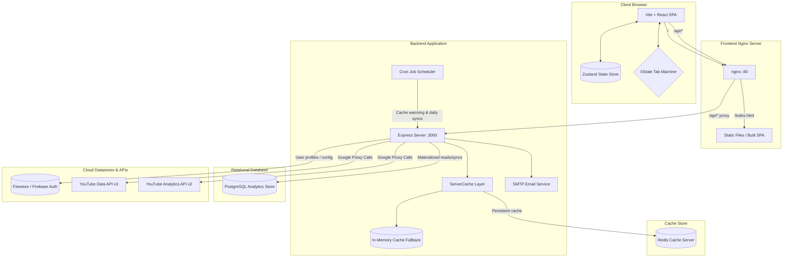
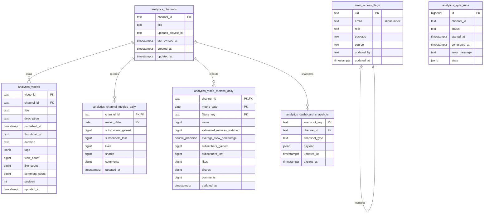
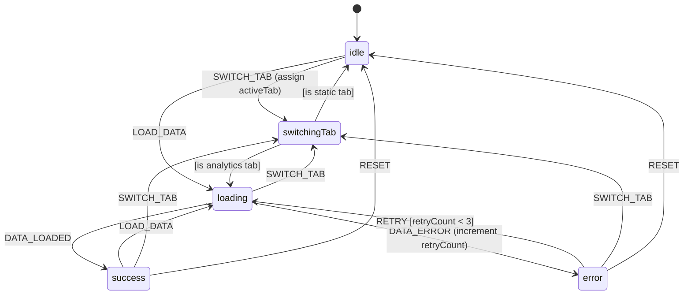

> **This document is preserved for history only. Do not treat it as current.**
>
> It is the original `docs/PROJECT_GUIDE.md`, kept because it records the shape of
> the system at a point in time. It is wrong in several important ways:
>
> - It says the charts are **Recharts**. They are Apache ECharts 6 via the in-repo
>   EvilCharts provider. Recharts is not a dependency.
> - It says the UI wraps **Material UI**. MUI was removed. The primitives are
>   shadcn-based (Radix + Tailwind), with a leftover `sx`/`Mui*` compat shim in
>   `components/ui/accordion.tsx`.
> - It says there is no `routes/` folder and that endpoints are added to `index.js`.
>   There are about 30 router factories in `backend/routes/`.
> - It predates Anomaly Detection, Goals, Channel Focus, Public Audit, the Full
>   Audit Orchestrator and Custom Dashboards entirely.
> - Its package versions are several majors behind.
>
> For current behaviour, start at
> [Project Overview](../01-Project%20Overview/Project%20Overview.md) and use the
> [API reference](../02-Backend%20Service/01-API%20Endpoints%20%26%20Middleware.md).

# RevTube System & Architecture Guide (legacy)

RevTube (also known as TubeKeter Analytics) is a high-performance, enterprise-grade YouTube channel analytics and list management dashboard built with React, Express, PostgreSQL, Redis, and Firebase. This document serves as the master guide for developers and operators, describing the system architecture, directory layouts, database schemas, APIs, caching policies, state machines, and deployment specifications.

---

## 1. System Architecture & Data Flow

RevTube is structured as a React Single Page Application (SPA) communicating with an Express REST API backend. The system incorporates Redis for low-latency JSON response caching, PostgreSQL for daily analytics ingestion and snapshot stores, and Firebase (Authentication & Firestore) for user registration, user metadata, and organization settings.



### Request Lifecycle

1. **User Sign-In**: The client logs in using Firebase Auth. For YouTube integration, the client exchanges Google OAuth codes for tokens, which are saved in Firestore.
2. **API Requests**: Authenticated API calls from the browser send a Firebase ID token in the `X-Firebase-Token` header, and (for YouTube features) a YouTube OAuth access token in the `Authorization: Bearer` header.
3. **API Routing**: Nginx intercepts requests. Static assets are served from `/`; `/api/*` is proxied to the Express backend.
4. **Middleware Validation**:
   - `authenticateRequest` checks the Firebase ID token via `firebase-admin` and extracts the user's email.
   - `resolveUser` looks up the user's profile and package (free vs pro) in PostgreSQL or Firestore, caching the result.
   - `checkPremiumAccess` and `requireQuota` enforce subscription tiering and rate limiting (`requireQuota` checks only; `consumeQuota` increments on cache miss -- see §6).
5. **Caching & Store Resolving**: The route builder checks `ServerCache` (backed by Redis or Memory). On a hit, cached data is decompressed and returned. On a miss, the backend either queries PostgreSQL (default `postgres-first` mode) or fetches live data from Google APIs, writes to cache, and returns.
6. **AI Chat (SSE)**: The `/api/chat/*` endpoints bypass the standard caching pipeline. Messages are handled by a DeepSeek-powered agent loop that streams SSE events (tokens, tool_start/end, thoughts) directly to the client. Conversation history is dual-stored in Redis (hot cache) and PostgreSQL (persistence). Usage quota is consumed per-message via `requireQuota("chat")`.

---

## 2. Directory Layout Map

```
RevTube/
├── docker-compose.yml       # Production-style topology (postgres, redis, backend, frontend)
├── package.json             # Root workspace configuration
├── pnpm-lock.yaml           # Shared lockfile
├── docs/                    # Architectural documents
│   ├── CACHING.md           # Cache TTLs, Redis configuration, and admin utilities
│   ├── CHAT.md              # AI Chat system overview (DeepSeek agent, SSE, tools)
│   ├── DESIGN_LANGUAGE.md   # Design rules, typography, button classes, CSS variables
│   ├── DRIZZLE_ORM.md       # Drizzle ORM schema, migration pipeline, and read models
│   ├── PROJECT_GUIDE.md     # [This Document] Master architecture & reference guide
│   └── QUEUE.md             # BullMQ queue system documentation
├── backend/                 # Node/Express API Server
│   ├── Dockerfile           # Backend builder (alpine-node based)
│   ├── README.md            # Setup, API reference, env vars
│   ├── index.js             # Wiring hub -- imports, service/router creation, Express setup
│   ├── cron.js              # Scheduled queue enqueuing, admin trigger endpoints
│   ├── emailService.js      # Transporter & templates for invitations/ownership transfers
│   ├── start.sh             # Entry script running migrations and starting Node
│   ├── chat/                # AI Chat system (DeepSeek agent)
│   │   ├── index.js         # Wiring hub + Express router (REST + SSE endpoints)
│   │   ├── AgentExecutor.js # DeepSeek streaming agent loop (max 10 iterations)
│   │   ├── ToolRegistry.js  # Central registry for 8 YouTube analytics tools
│   │   ├── Guardrails.js    # Input/output/tool security (injection detection, PII redaction)
│   │   ├── ConversationMemory.js # Redis + PostgreSQL dual-storage conversation persistence
│   │   ├── tools/           # Individual tool implementations (searchVideos, getChannelInfo, etc.)
│   ├── queue/               # BullMQ job queue system
│   │   ├── index.js         # Queue service factory (ingestion, cache-warm, email queues + workers)
│   │   ├── ingestionQueue.js # Ingestion job processor
│   │   ├── cacheWarmQueue.js # Cache-warming job processor
│   │   ├── emailQueue.js    # Email job processor (invitation, ownership transfer)
│   │   └── videoAuditQueue.js # Video audit job processor (LLM scoring)
│   ├── routes/              # Express router factories (one per API domain)
│   │   ├── oauth.js         # OAuth code exchange + token refresh
│   │   ├── user.js          # User sync/init
│   │   ├── organization.js  # Org invite, ownership transfer, member invalidation
│   │   ├── admin.js         # User/package/role management, cache ops, config
│   │   ├── usage.js         # Usage queries + synthetic track endpoint
│   │   ├── channels.js      # Channel lookup (mine, id, handle, username)
│   │   ├── playlists.js     # Playlist listing + items
│   │   ├── videos.js        # Video metadata + specific-videos
│   │   ├── captions.js      # Caption/subtitle fetching (YouTube Captions API via OAuth)
│   │   ├── dashboard.js     # Summary + bundle endpoints
│   │   ├── analytics.js     # Analytics report + dimensions
│   │   ├── compare.js       # Channel comparison (videos + metrics)
│   │   ├── channelVideos.js # Channel video listing
│   │   ├── audit.js         # Deterministic channel/playlist audit scoring
│   │   └── videoAudit.js    # Async LLM video audit (enqueue, job poll, history)
│   ├── middleware/          # Request processing pipeline
│   │   ├── auth.js          # authenticateRequest, checkAdmin, resolveUser
│   │   ├── premiumAccess.js # checkPremiumAccess (pro-tier gating)
│   │   ├── quota.js         # requireQuota + consumeQuota (two-phase billing)
│   │   ├── rateLimiter.js   # oauthLimiter, authLimiter, analyticsReadLimiter, adminLimiter, resolveLimiter
│   │   ├── orgToken.js      # resolveOrgToken (org channel token override)
│   │   ├── configVersion.js # checkConfigVersion middleware (analytics cache invalidation)
│   │   └── requestLogger.js # Per-request logging + AsyncLocalStorage
│   ├── services/            # Business logic
│   │   ├── analyticsService.js    # YouTube Analytics report fetching
│   │   ├── dashboardBundle.js     # Dashboard bundle generation
│   │   ├── dimensionsService.js   # Audience dimension data
│   │   ├── channelVideosService.js # Channel video listing + enrichment
│   │   ├── tokenService.js        # Google OAuth token refresh
│   │   ├── quotaService.js        # Quota accounting (readCount, incrementCount, dedup)
│   │   ├── videoAuditService.js   # Async LLM video scoring (scoreVideo, auditBatch)
│   │   ├── videoAuditLLM.js       # Gemini (images) + DeepSeek (text) adapters
│   │   └── auditScoringService.js # Deterministic channel/playlist audit scoring
│   ├── cache/               # Caching layer
│   │   ├── ServerCache.js   # Unified cache abstraction (Redis + in-memory LRU + gzip)
│   │   ├── userCache.js     # getCachedUser, invalidateCachedUser
│   │   └── orgCache.js      # getCachedOrg, getCachedOrgMembership, deleteCachedOrgMembership, warmOrgMemberCache
│   ├── config/              # Feature configuration & versioning
│   │   ├── featureConfig.js # getFeatureConfig, mergeFeatureConfigPages, DEFAULT_FEATURE_CONFIG
│   │   ├── configVersion.js # getConfigVersion, bumpConfigVersion
│   │   └── auditCriteria.js # Default video audit criteria (keys, weights, elements, niches)
│   ├── utils/               # Shared utilities
│   │   ├── perfLog.js       # Performance logging helpers
│   │   ├── inflight.js      # withInFlight, withInFlightTimeout (cache stampede prevention)
│   │   ├── cacheScope.js    # youtubeDataScope, dashboardScope, sanitizeCacheSegment, YT_DATA_CACHE_TTL_MS
│   │   └── handleApiError.js # Standard YouTube API error handler
│   ├── db/                  # PostgreSQL Client & Migrations
│   │   ├── client.js        # pg Pool setup and connection wrappers
│   │   ├── drizzle.js       # Singleton getDb() -- Drizzle ORM wrapper (lazy, null-safe)
│   │   ├── migrate.js       # SQL migration execution framework (hash-based)
│   │   ├── schema.js        # Drizzle ORM pgTable definitions (7 tables)
│   │   ├── userAccessStore.js # Postgres user role/package access store
│   │   ├── drizzle/         # Drizzle-kit generated migration files
│   │   │   ├── 0000_initial.sql
│   │   │   └── meta/_journal.json
│   │   └── migrations/      # Legacy versioned schema migrations
│   ├── drizzle.config.js    # Drizzle-kit CLI configuration
│   └── ingestion/           # Postgres Ingestion Engine
│       ├── store.js         # SQL inserts/updates for channels, videos, daily metrics
│       ├── sync.js          # Ingestion runner mapping YouTube API JSONs to tables
│       ├── snapshots.js     # Dashboard state snapshot serialization
│       ├── readModels.js    # Optimized DB query loaders (raw SQL, original)
│       └── readModelsDrizzle.js # Drizzle ORM parameterized read model replacements
└── frontend/                # Vite + React 19 SPA
    ├── Dockerfile           # Multi-stage build (Vite compiler + Nginx runner)
    ├── nginx.conf           # Reverse proxy mapping /api to http://backend:3000
    ├── package.json         # UI dependencies (TanStack, Zustand, XState, Recharts)
    ├── vite.config.ts       # Compiler options, environment targets, and Dev server proxy
    └── src/                 # Application codebase
        ├── App.tsx          # Router config, Suspense boundaries, and Auth guards
        ├── main.tsx         # Virtual DOM renderer mounting context providers
        ├── styles/          # Shared CSS rules
        │   ├── design-tokens.css # Color variables, font scaling, button variants
        │   └── muiTheme.ts  # Material-UI custom overrides synced with tokens
        ├── contexts/        # React Context providers (Auth, Org, Theme, Features)
        ├── stores/          # Zustand State Stores
        │   └── dashboardStore.ts # Centralized UI, video filters, list state managers
        ├── machines/        # Declarative State Machines
        │   └── dashboardMachine.ts # XState machine managing analytics loading loops
        ├── pages/           # Routed view containers (one folder per route)
        │   ├── dashboard/DashboardPage.tsx # Analytical graphs, widgets, and filters
        │   ├── videos/VideosPage.tsx    # Scrollable table grids and playlist search views
        │   ├── organization/OrganizationPage.tsx # Org structures, billing, invite modals
        │   └── … (admin, auth, channel, chat, compare, goals, optimized,
        │        playlist, audit-orchestrator, video-audit, thumbnail-optimizer,
        │        playlist-optimizer, profile, readme, specific-videos)
        └── components/      # Reusable visual widgets
            ├── VideoTable.tsx   # Spreadsheet-like grid with CSV/PDF features
            ├── Compare.tsx      # Multi-period comparison visualizer
            ├── EmptyState.tsx   # Page-level empty/zero-state placeholder
            ├── ConfirmModal.tsx # MUI Dialog confirmation for destructive actions
            └── charts/          # Custom SVG Recharts graphs
```

---

## 3. Database Schema Reference

RevTube leverages both **PostgreSQL** (for structured, high-frequency, write-heavy analytics data and local user configurations) and **Cloud Firestore** (for hierarchical user accounts, organization structures, and YouTube OAuth credentials).

### 3.1. PostgreSQL Relational Schema

The schema is defined in two places that must be kept in sync:

1. **Legacy SQL migrations** (`backend/db/migrations/`) -- hand-authored `.sql` files
2. **Drizzle ORM definitions** (`backend/db/schema.js`) -- `pgTable` objects that drive Drizzle's query builder and auto-generated migrations

Both describe the same physical tables. When adding a new column or table, update `schema.js` and run `npx drizzle-kit generate` to produce a migration `.sql` file. See [`docs/DRIZZLE_ORM.md`](../07-Infrastructure & Deployment/03-Drizzle ORM & Migration Runner) for the complete Drizzle workflow.



#### SQL Schema Definitions

- **`analytics_channels`**: Keeps track of YouTube channel profiles synced to the local store.
- **`analytics_videos`**: Stores individual video metadata, metrics counters, duration, and thumbnail paths.
- **`analytics_channel_metrics_daily`**: Stores overall channel subscription changes and engagement metrics per day.
- **`analytics_video_metrics_daily`**: Stores time-series daily metrics (views, watch minutes, engagement) mapped by channel. Supports filters via the `filters_key` (e.g. `playlist==PL...` or `video==v1,v2`).
- **`analytics_dashboard_snapshots`**: Stores pre-computed JSON states of heavy dashboard charts/bundles to avoid rebuilding.
- **`user_access_flags`**: Tracks authorization levels (e.g. `admin`, `user`) and subscription tiers (`pro`, `free`) synced from Firestore to bypass network limits on auth lookups.
  - **Unique constraint**: `idx_user_access_flags_email_lower` on `lower(email)` prevents duplicate email rows. The `upsertUserAccess` function in `backend/db/userAccessStore.js` inserts with `ON CONFLICT(uid) DO UPDATE`; if a second Firebase Auth user exists with the same email but different UID, the email unique constraint fires and the function falls back to `UPDATE ... WHERE LOWER(email)=LOWER($email)`. This handles the rare case where a Firebase Auth user is re-created or duplicated for the same email address.
- **`analytics_sync_runs`**: Operational log of scheduled ingestion runs tracking duration, records processed, and potential errors.

### 3.2. Firestore Collection Hierarchy

- **`users/{uid}`**:
  - `email` (string), `role` (string: `admin` | `user`), `package` (string: `free` | `pro`), `uid` (string)
- **`users/{uid}/youtubeTokens/{tokenId}`**:
  - `channelId` (string), `channelTitle` (string), `refreshToken` (string), `accessToken` (string), `updatedAt` (timestamp)
- **`users/{uid}/usage/{monthYyyyMm}`**:
  - `dashboard` (number), `videos` (number), `channel` (number), `playlists` (number), `compare` (number)
- **`organizations/{orgId}`**:
  - `name` (string), `ownerId` (string), `plan` (string: `free` | `pro`), `createdAt` (timestamp)
- **`organizations/{orgId}/members/{uid}`**:
  - `email` (string), `role` (string: `owner` | `admin` | `write` | `read`), `joinedAt` (timestamp)
- **`config/features`**:
  - `pages` (map containing features, limit counts, and flags)

---

## 4. Authentication, Middleware, and Access Controls

Authentication relies on **Firebase Authentication**. Security middleware translates user tokens into server-side sessions and rate limits.

```
Request Headers:
  X-Firebase-Token: <Firebase ID Token>
  Authorization: Bearer <YouTube OAuth Access Token> [Optional]
  X-Org-Id: <Organization ID> [Optional]
```

### Middleware Components

1. **`authenticateRequest`**:
   - Inspects `req.headers['x-firebase-token']`.
   - Invokes `admin.auth().verifyIdToken(token)`.
   - Sets `req.authUser = { uid, email, claims }`. Returns `401 Unauthorized` if invalid.
2. **`resolveUser`**:
   - Invokes `getCachedUser(email)`.
   - Resolves roles and package attributes (from PostgreSQL `user_access_flags`, falling back to Firestore if missing).
   - Attaches details to `req.currentUser`.
3. **`checkPremiumAccess(pageKey)`**:
   - Loads global limitations via `getFeatureConfig()`.
   - If the feature is `premiumOnly`, verifies if `req.currentUser` is `pro` or `admin`.
   - Also checks if `req.headers['x-org-id']` points to an organization with plan `pro`. **Security**: verifies live org membership via `getCachedOrgMembership(orgId, uid)` before granting inherited access -- a spoofed `X-Org-Id` header alone is insufficient.
   - If access is denied, halts request with `403 Forbidden` (`PREMIUM_REQUIRED`).
4. **`requireQuota(pageKey)`** + **`consumeQuota(req, opts)`** (two-phase billing):
   - **`requireQuota`** fetches monthly limits via `quotaService.resolvePageLimit()` and reads the current count via `quotaService.readCount()`. Blocks with `429 Too Many Requests` (`LIMIT_EXCEEDED`) if exhausted. Stores context on `req.quotaContext` but does **not** increment.
   - **`consumeQuota(req, opts)`** is called **after** the YouTube API call, **only on cache miss**. Cache hits do NOT consume quota. Can also be triggered via `req.quotaBillable` (set by `quotaService.markBillable(req)`) when `opts.billable` is not explicitly set.
   - Dashboard bundle: `markQuotaBillable(req)` is called before YouTube Analytics API calls, and `consumeQuota` fires at the end of the pipeline -- one dashboard request always consumes exactly one quota unit. Cron warming passes no `req`, so scheduled jobs never increment user usage.
   - **`POST /api/usage/track`**: A lightweight synthetic endpoint for page keys (like `"compare"`) that have no dedicated backend route but still need per-request quota tracking. Runs `requireQuota(pageKey)` + `consumeQuota(req, { billable: true })` and returns `{ success: true }` or `429`. Called **upfront** by the Compare page before any channel-resolution API calls.
   - **Resolve-only context**: When the frontend sends `X-Usage-Context: resolve`, `requireQuota` returns `next()` early before any counter interaction. These are internal ID-resolution steps (e.g. handle → uploads playlist) that must not be blocked by a different page's quota exhaustion.
   - **Usage info in responses**: A middleware auto-attaches `_usage: { used, limit, pageKey }` to every JSON response, enabling the frontend to display real-time quota usage without extra API calls.
5. **`checkConfigVersion` middleware**:
   - Compares the live Firestore `config/version` document against `req.configVersion` (set at request start). On mismatch, calls `invalidateAnalyticsCache()` to clear all analytics-related cache keys (`dashSummary:`, `dashSnap:`, `snapshot:`, `yt:ytan:report:`, `bundle:`).
   - `bumpConfigVersion()` is called by `PUT /api/admin/config` after saving feature config changes, ensuring quota and `premiumOnly` changes take effect immediately without waiting for cache TTL.
   - `getConfigVersion()` reads the current version (returns `0` on error).
5. **`resolveOrgToken(channelIdSource)`**:
   - Activated by the `X-Org-Id` request header.
   - Reads the organization ID from `req.headers['x-org-id']`, then resolves the channel ID via the `channelIdSource` callback (either a static string like `req.params.channelId` or a dynamic function that extracts it from query params).
   - Looks up `organizations/{orgId}/channels/{channelId}` in Firestore and, if found, overrides `req.headers.authorization` with the stored `accessToken` and stores the `refreshToken` on `req._orgRefreshToken`.
   - Sets `req._orgTokenResolved = true` so downstream inline resolution in route handlers can skip redundant Firestore lookups.
   - Applied to: `/channel/id/:id`, `/playlists/:channelId`, `/dashboard/summary`, `/dashboard/bundle`, `/analytics/dimensions`, `/channel-videos/:channelId`, `/analytics/report`.
6. **`checkAdmin`**:
   - Confirms `req.authUser.email === 'support@revketer.ai'` (hardcoded fallback) or role equals `admin` in database.
   - Blocks non-admin requests with `403 Forbidden`.

---

## 5. Ingestion Engine & Cron Operations

To maximize performance, RevTube can run in `postgres-first` mode, loading historical data from the local relational store rather than querying Google APIs directly. The ingestion pipeline populates this PostgreSQL store.

### 5.1. Daily Ingestion Pipeline (`ingestChannelDaily`)

The ingestion pipeline is designed as an atomic task that fetches, processes, and upserts data:

```
[Record Sync Start in analytics_sync_runs]
                 │
                 ▼
[Query /channels to fetch Uploads Playlist ID]
                 │
                 ▼
[Fetch Playlists Items & Enrich metadata via /videos API]
                 │
                 ▼
[Batch Upsert Video records to analytics_videos]
                 │
                 ▼
[Query YouTube Analytics Reports for Channel & Video timelines]
                 │
                 ▼
[Map JSON array rows by Column Headers into Metric Objects]
                 │
                 ▼
[SQL Transaction: Upsert metrics to daily stats tables]
                 │
                 ▼
[Commit Transaction & Update analytics_sync_runs to 'success']
```

- **Retry Mechanism**: Critical YouTube API fetches are wrapped in `withRetry(fn, label, retries)`. It catches `429` (rate limits) and `5xx` (network errors) and applies exponential backoff up to 8 seconds.
- **Batch Operations**: Video imports are wrapped in PostgreSQL transaction statements (`BEGIN / COMMIT / ROLLBACK`) utilizing a connection client pool to ensure consistency and speed.

### 5.2. Scheduled Jobs (`cron.js`) -- Queue-Driven Architecture

Scheduled routines execute in the background using `node-cron`:

- **Cron Pattern**: `0 3,9,15,21 * * *` (runs every 6 hours, starting at 3:00 AM server time).
- **Queue-Driven Execution**: Instead of running work sequentially, cron now **discovers channels** and **enqueues jobs** to BullMQ queues. Workers process jobs in parallel with automatic retries:

  - **Cache Warming (`runCacheRefresh`)**:
    - Queries Firestore `youtubeTokens` collection group to extract refresh tokens for active channels.
    - Requests YouTube OAuth access tokens via `refreshGoogleToken()` -- tokens are **cached** in Redis/memory under `oauth:token:{shortHash(refreshToken)}` with a **55-minute TTL**, so duplicate refreshes within the same cron window reuse the cached access token.
    - Enqueues `warm` jobs to the `cache-warm` BullMQ queue (concurrency: 5 workers).
    - Each `warm` job executes **6 warming phases** with progress tracking:
      1. **Dashboard bundles** -- `generateDashboardBundle` for 7d, 30d, 90d periods
      2. **Dimensions** -- `generateDimensions` for 7d, 30d, and 90d ranges (was 90d only)
      3. **Video list** -- `generateChannelVideos` (up to 500 videos)
      4. **DB audience active time** -- `generateAudienceActiveTimeFromDb` (view-velocity hourly model)
      5. **Retention trend** -- `generateRetentionByHour` (30-day rolling)
      6. **YT audience day-of-week** -- `generateAudienceActiveTime` (day-of-week breakdown with engagement)
    - If any phase fails, it logs a warning but does NOT abort remaining phases. Cold hits still fall through to the synchronous path.
    - Stale `snapshot:` and `summary:` Redis keys are cleared **before** any jobs are enqueued.
    - Jobs are spread with a 500ms delay margin to prevent a thundering-herd against YouTube's API.
    - Uses `org:{orgId}:{channelId}` scoping for org-owned channels (cron builds a `channelId → orgId` map from the `org/channels` Firestore collection group).
    - **Scheduled invocation cap**: `maxChannels: 50` (cache refresh).

  - **PostgreSQL Ingestion (`runPostgresIngestion`)**:
    - Resolves active tokens and enqueues `ingest` jobs to the `ingestion` BullMQ queue (concurrency: 3 workers).
    - Each `ingest` job calls `ingestChannelDaily` (up to 500 videos and 120 days of metrics).
    - Transient YouTube API failures are automatically retried (3 attempts, exponential backoff: 30s → 2m → 5m).
    - **Scheduled invocation cap**: `maxChannels: 100`.

  - **Comparison: Before vs After**:

    | Aspect | Sequential (Old) | Queue-Driven (New) |
    |--------|-----------------|-------------------|
    | 4-channel cache warm | ~20s+ wall clock | ~5s wall clock |
    | Transient API failure | Lost, wait 6h | Retried 3× with backoff |
    | Processing visibility | Log lines only | Bull Board dashboard |
    | Job history | None | 7–14 day retention |

- **Admin trigger endpoints** (registered directly on `app` with `authenticateRequest` + `checkAdmin`):

  | Endpoint | Queue | Purpose |
  |----------|-------|---------|
  | `POST /admin/cache/refresh-all` | `cache-warm` | Enqueue cache-warm jobs for all channels |
  | `POST /admin/ingestion/refresh-all` | `ingestion` | Enqueue ingestion jobs for all channels |
  | `POST /admin/ingestion/refresh-channel` | `ingestion` | Enqueue single-channel ingestion job |
  | `GET /admin/queue/metrics` | All | Returns job counts per queue |

- **Bull Board monitoring UI**: Available at `/admin/queues` (behind `authenticateRequest` + `checkAdmin`). Provides live job counts, error stack traces, and manual job retry. Accessed from the AdminPage via the "Open Queue Dashboard" button (uses `bull_board_token` cookie, 1h TTL, `SameSite=Strict`).

- **Email queue**: The organization route's `POST /send-invitation` and `POST /send-ownership-transfer` now return 200 immediately and enqueue email jobs to the `email` queue (concurrency: 2, retries: 3). No longer blocking the HTTP response cycle.

---

## 6. Caching Policy & Specifications

The cache manager (`ServerCache`) uses Redis for distributed caching, falling back to a local in-memory Map. Payloads exceeding 1KB are gzip-compressed (stored in base64 format) to reduce storage footprints.

### 6.1. Cache Key Patterns & Scope

OAuth responses can include private data. To prevent cache leaks, keys incorporate scopes based on authentication:

- **Public Cache Scope (`pub`)**: For requests without authorization headers.
- **User Cache Scope (`u:{email}`)**: For authenticated users.
- **Fallback Cache Scope (`t:{shortHash(authorization)}`)**: Avoids storing raw tokens by hashing them (SHA-256, first 20 characters).

| Cache Prefix                    | Target Route / Context                             | TTL Duration    | Scope                        |
| ------------------------------- | -------------------------------------------------- | --------------- | ---------------------------- |
| `yt:ch:user:`                   | `/api/channel/username/:username`                  | 4 hours         | Public or Authenticated      |
| `yt:ch:id:`                     | `/api/channel/id/:id`                              | 4 hours         | Public or Authenticated      |
| `yt:pl:list:`                   | `/api/playlists/:channelId`                        | 2 hours         | Public or Authenticated      |
| `yt:pl:one:`                    | `/api/playlist/:id`                                | 2 hours         | Public or Authenticated      |
| `yt:pl:items:`                  | `/api/playlist-items/:playlistId`                  | 45 minutes      | Public or Authenticated      |
| `yt:videos:`                    | `/api/videos?ids=...`                              | 25 minutes      | Public or Authenticated      |
| `yt:channels:mine:`             | `/api/channels/mine`                               | 12 minutes      | User-scoped                  |
| `yt:ytan:report:`               | `/api/analytics/report`                            | 12 minutes      | User-scoped                  |
| `channel_videos:`               | `/api/channel-videos/:channelId`                   | 90 minutes      | User or Cron-scoped          |
| `dashSummary:v2:{mode}:{scope}:` | `/api/dashboard/summary`                        | 12 minutes      | Org/User-scoped              |
| `bundle:video:v2:{scope}:`       | `/api/dashboard/bundle`                          | 12 minutes      | Org/User-scoped              |
| `bundle:channel:v2:{scope}:`     | `/api/dashboard/bundle`                          | 12 minutes      | Org/User-scoped              |
| `bundle:playlistViews:v2:{scope}:` | `/api/dashboard/bundle`                       | 12 minutes      | Org/User-scoped              |
| `dashSnap:{kind}:{channelId}:{digest}` | Snapshot store (Postgres/Redis)              | 6 hours         | Org/User-scoped (digest)     |
| `dims_v2:{scope}:`               | `/api/analytics/dimensions`                       | 45 minutes      | Org/User-scoped              |
| `dims_ch_v2:{scope}:`            | `/api/analytics/dimensions`                       | 45 minutes      | Org/User-scoped              |
| `user:{email}`                  | Firestore identity resolver                        | 24 hours        | Global Redis                 |
| `org:{orgId}`                   | Organization detail cache                          | 24 hours        | Global Redis                 |
| `org:{orgId}:member:{uid}`      | Org membership boolean (premium/usage inheritance) | 15 minutes      | Global Redis + in-memory LRU |
| `oauth:token:{hash}`            | `refreshGoogleToken()` access tokens               | 55 minutes      | Global Redis + in-memory     |
| `compare:videos:`              | `POST /api/compare/videos`                       | **1 hour**      | **None (shared)** -- No user/org scope; any user comparing the same channel reuses the cached result |
| `usage:{uid}:{pageKey}:{month}` | Monthly API usage counter                          | Until month end | Redis (Firestore fallback)   |

### 6.2. Organization membership cache invalidation

Org member removal and org deletion are written directly to Firestore from the frontend (`organizationService.ts`). To avoid an up-to-15-minute grace period where removed users retain org-plan limits:

1. Frontend commits the Firestore batch (delete member doc, update user orgs array, etc.).
2. Frontend calls **`POST /api/organization/invalidate-member`** with `{ organizationId, userId }` (fire-and-forget).
3. Backend verifies the caller is the removed user, an org owner/admin, or a system admin, then calls **`deleteCachedOrgMembership(orgId, uid)`** to evict `org:{orgId}:member:{uid}` from Redis and the in-memory LRU.

Called automatically after `removeMember`, `leaveOrganization` (via `removeMember`), and `deleteOrganization` (once per former member).

## 7. API Route Reference

All endpoints are mounted under the `/api` base path.

### 7.1. Public Endpoints

- **`GET /health`**
  - **Description**: Microservice health-check endpoint.
  - **Returns**: JSON object containing uptime, timestamp, memory metrics, and status (`ok`).
- **`GET /api/proxy-image?url=<ImageURL>`**
  - **Description**: Image proxy that bypasses CORS headers for client-side PDF document generation.
  - **Headers**: Public access. Cached for 24 hours via `Cache-Control`.
- **`POST /api/oauth/exchange`**
  - **Description**: Exchanged Google auth code for access/refresh tokens.
  - **Body**: `{ code: "..." }`
  - **Returns**: YouTube credential token details.
- **`POST /api/oauth/refresh`**
  - **Description**: Refreshes expired Google access tokens using stored credentials.
  - **Body**: `{ refreshToken: "..." }`
- **`GET /api/admin/config`**
  - **Description**: Read global feature configurations (limits, active modules). Served from backend in-memory cache (`getFeatureConfig()`, **10-min TTL**). On cache miss, reads Firestore `config/features` and re-caches. Frontend polls every **1 minute** via `refetchInterval`.

### 7.2. Authenticated Endpoints

Requires header: `X-Firebase-Token: <Token>`. Optional header: `Authorization: Bearer <GoogleToken>`.

- **`POST /api/user/sync`**
  - **Description**: Synchronizes Firebase user details with Firestore/PostgreSQL user stores.
  - **Body**: `{ email: "...", uid: "..." }`
- **`POST /api/user/init`**
  - **Description**: Configures initial user profile setup and provisions access records.
- **`POST /api/organization/send-invitation`**
  - **Description**: Sends an email invitation to join an organization.
  - **Body**: `{ organizationId: "...", inviteeEmail: "...", role: "read" | "write" | "admin" }`
- **`POST /api/organization/send-ownership-transfer`**
  - **Description**: Requests organization ownership transfer.
  - **Body**: `{ organizationId: "...", newOwnerEmail: "..." }`
- **`POST /api/organization/invalidate-member`**
  - **Description**: Evicts backend org membership cache after Firestore member removal or org deletion. Called by the frontend immediately after successful Firestore writes.
  - **Body**: `{ organizationId: "...", userId: "..." }`
  - **Auth**: `X-Firebase-Token` required. Caller must be the user being removed, an org owner/admin, or a system admin.
- **`GET /api/channels/mine`**
  - **Description**: Lists authorized YouTube channels linked to the credentials.
- **`GET /api/playlists/:channelId`**
  - **Description**: Lists YouTube playlists for a channel.
- **`GET /api/playlist/:id`**
  - **Description**: Fetches metadata for a single playlist.
- **`GET /api/playlist-items/:playlistId`**
  - **Description**: Fetches video items inside a playlist.
- **`GET /api/videos?ids=id1,id2`**
  - **Description**: Fetches rich metadata details for a comma-separated list of video IDs.
- **`GET /api/usage/me`**
  - **Description**: Returns current monthly query usage counts and limits for the user.
- **`POST /api/compare/videos`**
  - **Description**: Fetches all videos from a channel's uploads playlist, enriches with statistics, and pre-computes analytics metrics. Cached in Redis (1h TTL, shared across all users). Protected by `checkPremiumAccess("compare")`.
  - **Body**: `{ playlistId: "...", startDate?: "...", endDate?: "..." }`
  - **Cache key**: `compare:videos:{playlistId}{:startDate_endDate}` (no user scope)

### 7.3. Ingestion & Analytics Endpoints

- **`GET /api/analytics/report`**
  - **Description**: Direct query proxy to YouTube Analytics API.
- **`POST /api/dashboard/summary`**
  - **Description**: Fast multi-period overview metrics (7d, 30d, 90d summaries).
  - **Body**: `{ channelId: "...", clientLatestDate: "YYYY-MM-DD" }`
- **`POST /api/dashboard/bundle`**
  - **Description**: Heavy bundle route collecting channel metrics, historical charts, video lists, and anomaly logs. Returns `channelTotals` and `prevChannelTotals` so headline pills and chart data share one data source.
  - **Body**: `{ channelId: "...", period: 30, compare: true, trueDelta: false, filters: "...", fields: ["channelTotals", "chartData", "comparison"] }`
  - **`fields`** (optional): Array of data groups to include. Omitting a field skips its sub-query. Default: `["channelTotals", "chartData", "comparison", "videos"]`. Available values: `channelTotals`, `chartData`, `comparison`, `videos`, `dimensions`.
  - **Response addition**: `channelTotals: { views, watch_time, subscribers_gained, subscribers_lost, likes, comments, shares }` and `prevChannelTotals: { same shape }` -- aggregate channel-level totals computed from the same data source as chart bars, eliminating the mismatch between headline pills and chart data.
- **`POST /api/analytics/dimensions`**
  - **Description**: Compiles audience demographics (traffic source, country, age/gender).
  - **Body**: `{ channelId: "...", startDate: "...", endDate: "...", filters: "..." }`
- **`POST /api/compare/videos`**
  - **Description**: Fetches ALL videos from a channel's uploads playlist, enriches with statistics, and computes analytics metrics. Cached server-side (1h TTL, shared across all users).
  - **Body**: `{ playlistId: "...", startDate?: "...", endDate?: "..." }`
  - **Access**: `resolveUser` + `checkPremiumAccess("compare")`
  - **Cache key**: `compare:videos:{playlistId}{:startDate_endDate}` (no user scope -- shared cache)
  - **Returns**: `{ videos: [...], channelTitle, metrics: { totalVideos, totalViews, totalLikes, totalComments, avgViewsPerVideo, avgLikesPerVideo, avgCommentsPerVideo, avgLikesPerView } }`
- **`GET /api/channel-videos/:channelId`**
  - **Description**: Fetches a list of video details, mapping upload positions.

### 7.4. Admin-Only Endpoints

Requires Firebase token with admin role or `support@revketer.ai` account email.

- **`GET /api/admin/users`**: Lists registered users and credentials.
- **`PUT /api/admin/users/:uid/package`**: Updates user subscription packages (`free` vs `pro`).
- **`PUT /api/admin/users/:uid/role`**: Updates roles (`admin` vs `user`).
- **`PUT /api/admin/config`**: Edits global feature configuration limits.
- **`GET /api/admin/cache/stats`**: Detailed cache performance metrics (hit rate, compression ratios, and Redis status).
- **`POST /api/admin/cache/clear`**: Clears Redis cache databases and local Map stores.
- **`POST /api/admin/cache/metrics/reset`**: Resets server cache hits/misses counter.

#### Admin Queue Endpoints (outside `/api`, registered directly on `app`)

- **`POST /admin/cache/refresh-all`**: Enqueues cache-warm jobs to BullMQ `cache-warm` queue for all channels.
- **`POST /admin/ingestion/refresh-all`**: Enqueues ingestion jobs to BullMQ `ingestion` queue for all channels.
- **`POST /admin/ingestion/refresh-channel`**: Enqueues a single-channel ingestion job (body: `{ channelId, refreshToken }`).
- **`GET /admin/queue/metrics`**: Returns live job counts for all three queues (ingestion, cache-warm, email).
- **`/admin/queues`** (Bull Board UI): Queue monitoring dashboard (not an API endpoint -- serves HTML).

---

## 8. Frontend Core & Architecture

The frontend is built with React 19 and compiled via Vite. Data queries are managed using TanStack Query, UI layout state is managed with Zustand, and page loading flows are controlled with an XState machine.

### 8.1. State Machine Control Flow (`dashboardMachine.ts`)

The XState machine ensures predictable dashboard transitions, handling tab navigation and query lifecycle states.



### 8.2. Centralized Store (`dashboardStore.ts`)

Managed via **Zustand** + **Immer**, the store holds UI configurations, active selections, video filters, list builders, and data responses.

- **Features**:
  - Integrates Immer to allow direct mutations on draft states.
  - Persists selected channel tabs, chart types, and date ranges in `localStorage`.
  - Manages active lists and video selection states.
  - Provides atomic bulk actions (e.g. `resetChannelState`, `resetFilters`, `resetSelection`) when switching channels.

### 8.3. Channel selection hydration (`useDashboardChannel.ts`)

After the channel list loads from `useChannelsQuery`, the hook validates the persisted `selectedChannel` against available channels (scoped keys: `selectedChannel_personal_{uid}`, `selectedChannel_org_{orgId}`, and `selectedChannel_last`). If the persisted ID no longer exists (e.g. channel deleted server-side or token revoked), it calls **`resetChannelState()`** and selects the first available channel.

On workspace/context switches, the hook clears the channels array via **`setChannels([])`** as part of the `useLayoutEffect` cleanup. This ensures that when switching to a context with no channels, the downstream zero-channel unblock effect can set `channelSelectionHydrated: true` and allow the empty-state "Connect YouTube" UI to render.

### 8.4. Analytics client cache (`analyticsService.ts`)

The frontend mirrors server caching with `analyticsCache` (localStorage). In-flight request dedup uses a **`withInFlightTimeout`** wrapper (30s) on report, bundle, and dimensions fetches so a hung network request cannot permanently block subsequent callers with the same cache key.

**Manual cache clearing**: The dashboard toolbar includes a refresh button that calls `clearAnalyticsCache()` (in-memory Map + `sessionStorage`) followed by React Query `refetch()` calls. This is the intended "pay quota for fresh data" action -- normal tab switches reuse the 24-hour analytics cache at no quota cost.

### 8.5. Styling & Theming System

RevTube uses a tokenized design system to maintain consistency without relying on complex UI libraries.

- **Design Tokens (`frontend/src/styles/design-tokens.css`)**: Defines variables for background colors, text hierarchies, border radii (`4px` for inputs/controls, `8px` for cards/modals), margins, and page layouts.
- **Theme Configuration (`frontend/src/styles/rtPalette.ts` / `muiTheme.ts`)**: Maps semantic tokens from the CSS file to the Material-UI theme, ensuring both custom CSS components and Material-UI elements share the same color palette.
- **Button Classes**: Defines utility classes (`.rt-btn--primary`, `.rt-btn--secondary`, `.rt-btn--ghost`, `.rt-btn--danger`, and `.rt-btn--youtube`) to ensure consistent button styling.

---

## 9. Environment Setup & Deployment

RevTube is containerized using Docker and is designed for easy deployment to systems like Coolify or Kubernetes.

### 9.1. Environment Variables Configuration

| Variable                          | Scope    | Description / Example                                    |
| --------------------------------- | -------- | -------------------------------------------------------- |
| `NODE_ENV`                        | Backend  | Runtime context (`production`, `development`).           |
| `PORT`                            | Backend  | Port the server listens on (default: `3000`).            |
| `YOUTUBE_API_KEY`                 | Backend  | YouTube Data API v3 token.                               |
| `YOUTUBE_CLIENT_ID`               | Backend  | Google OAuth Client ID.                                  |
| `YOUTUBE_CLIENT_SECRET`           | Backend  | Google OAuth Secret key.                                 |
| `VITE_FIREBASE_PROJECT_ID`        | Both     | Target Firebase application project ID.                  |
| `FIREBASE_SERVICE_ACCOUNT`        | Backend  | Stringified JSON or file path to Firebase credentials.   |
| `VITE_FRONTEND_URL`               | Backend  | Public URL for email links.                              |
| `SMTP_HOST` / `SMTP_PORT`         | Backend  | Mail server settings (e.g. `smtp.resend.com`, `587`).    |
| `SMTP_USER` / `SMTP_PASSWORD`     | Backend  | SMTP credentials.                                        |
| `SMTP_FROM` / `SMTP_FROM_NAME`    | Backend  | Sender identity details (e.g. `noreply@revketer.ai`).    |
| `REDIS_URL`                       | Backend  | Connection URL for cache Redis (e.g. `redis://:pwd@redis:6379`). Used by ServerCache (analytics cache, OAuth tokens, rate limiter data). `allkeys-lru` eviction, 256MB limit. |
| `QUEUE_REDIS_URL`                 | Backend  | Connection URL for BullMQ queue Redis (e.g. `redis://:pwd@redis-queue:6379`). Falls back to `REDIS_URL`. BullMQ uses its own instance for queue state, locks, and stall-detection. `noeviction` policy, 64MB limit. |
| `POSTGRES_HOST` / `POSTGRES_PORT` | Backend  | PostgreSQL connection target (e.g. `postgres`, `5432`).  |
| `POSTGRES_DB` / `POSTGRES_USER`   | Backend  | Database credentials.                                    |
| `POSTGRES_PASSWORD`               | Backend  | Database password.                                       |
| `ANALYTICS_SOURCE`                | Backend  | Data source (`postgres-first` or `youtube-only`).        |
| `DISABLE_COMPRESSION`             | Backend  | Set to `1` to disable cache payload compression.         |
| `PERF_LOG`                        | Backend  | Set to `1` to enable verbose cache and performance logs. |
| `USAGE_DEDUP_WINDOW_SEC`          | Backend  | Time window (seconds) for deduplicating parallel usage counter increments. Default `5`. Set to `0` to disable. **Declared but not yet wired into increment logic.** |
| `MAX_VIDEOS_PER_CHANNEL`          | Backend  | Max videos to fetch per channel during ingestion. Default `500`. Clamped to valid range with logged warning. **Declared but not yet wired into ingestion functions.** |
| `ADMIN_LIMIT_MAX`                 | Backend  | Admin rate limit per 15-min window. Default `60`.        |
| `OAUTH_LIMIT_MAX`                 | Backend  | OAuth endpoint rate limit per 15-min window. Default `30`. |
| `AUTH_LIMIT_MAX`                  | Backend  | Authenticated endpoint rate limit per 15-min window. Default `240`. |
| `ANALYTICS_READ_LIMIT_MAX`        | Backend  | Analytics read endpoint rate limit per 15-min window. Default `1200`. |
| `RESOLVE_LIMIT_MAX`               | Backend  | Resolve endpoint rate limit fallback (pro/free from FeatureConfig if available). Default `60`. |
| `VITE_BACKEND_URL`                | Frontend | API URL endpoint prefix (default `/api` in compose).     |
| `VITE_GOOGLE_CLIENT_ID`           | Frontend | Google OAuth client ID for browser flows.                |

### 9.2. Docker Compose Topology

The `docker-compose.yml` configures five interconnected services:

1. **`postgres`**: Relational database running PostgreSQL 16. Includes healthcheck `pg_isready` before accepting backend connections.
2. **`redis`**: Cache server (analytics, OAuth tokens, rate limiters). `allkeys-lru`, 256MB, container limit 384MB.
3. **`redis-queue`**: BullMQ state server (queue data, locks, stall-detection). `noeviction`, 64MB, container limit 128MB. Cache eviction on `redis` cannot affect queue integrity.
4. **`backend`**: Node.js Express server. Depends on `postgres`, `redis`, and `redis-queue` becoming healthy.
5. **`frontend`**: Nginx web server container serving the static React app. Proxies `/api/*` requests to `http://backend:3000`.

### 8.6. Reusable UI Components

Shared components used across multiple pages:

- **`EmptyState`** (`frontend/src/components/EmptyState.tsx`): Page-level placeholder for empty or unloaded views. Props: `icon`, `title`, `description`, `action`. Renders a centered flex column with no card/border shell. Used by ChannelPage, ComparePage, OrganizationPage, PlaylistPage, SpecificVideosPage, VideosPage.
- **`ConfirmModal`** (`frontend/src/components/ConfirmModal.tsx`): MUI Dialog wrapper for destructive or irreversible action confirmation. Used by Layout (logout confirmation) and AdminPage (refresh cache confirmation). Never use `window.confirm()` -- always route through ConfirmModal for consistent styling and async support.
- **Error banner** (auth error toast in `App.tsx` + `App.css`): Centered card-style toast on sign-in showing Firebase auth failures. Icon + title/body + dismiss button. Scale animation on appear.
- **Dashboard error banner** (`DashboardPage.tsx` + `DashboardPage.css`): Inline card when channel data fails to load. Includes Retry and Re-authorize (YouTube) actions. Responsive: buttons stack vertically ≤768px.

### 9.3. Production & Coolify Guidelines

- **Healthcheck dependencies**: Docker images use `curl` instead of `wget` for healthcheck scripts since `node:18-alpine` does not ship with `wget`.
- **Traefik Configuration**: Coolify uses environment variables (like `SERVICE_URL_FRONTEND_80`) to map the frontend service to the Traefik proxy.
- **Volume Persistence**: Ensure `redis-data` and `postgres-data` are mapped to persistent docker volumes.
- **Admin Fallback**: Set the SMTP and email values correctly in your environment to ensure transactional emails (like user invitations and role transfers) work.
